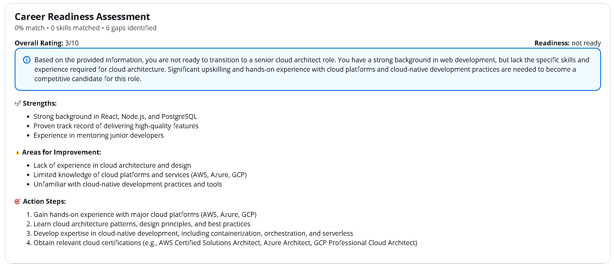
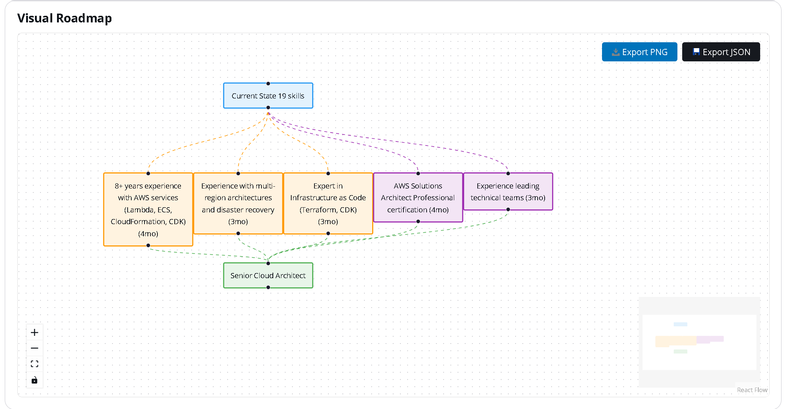
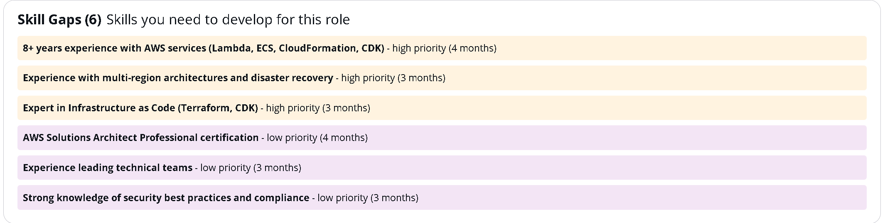
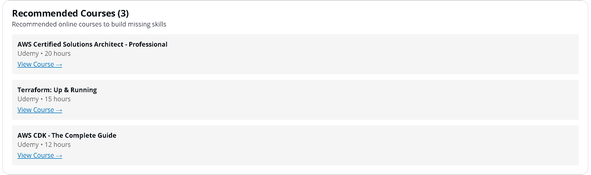
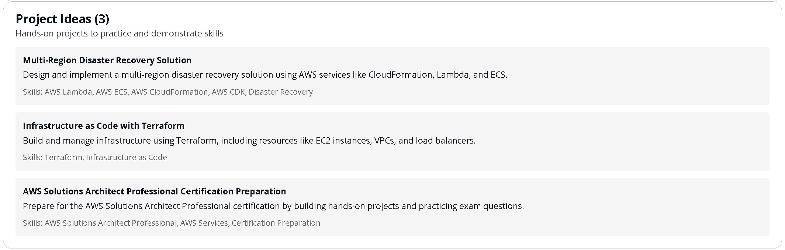

# 🗺️ Career Path Architect

> AI-powered career planning tool that designs personalized learning roadmaps using LangGraph and AWS Bedrock

[](https://opensource.org/licenses/MIT)
[](https://www.python.org/downloads/)
[](https://www.typescriptlang.org/)


---

## Why This Project

After building [Resume Tailor AI](https://github.com/jfowler-cloud/resume-tailor-ai) and [Scaffold AI](https://github.com/jfowler-cloud/scaffold-ai), I wanted to create a tool that helps professionals navigate their career growth with AI-powered insights. Career Path Architect analyzes your resume, compares it against target roles, and generates personalized learning roadmaps with actionable recommendations.

The goal was to demonstrate:

- **Extreme rapid development** -- Production-quality multi-agent system in 2 hours
- **LangGraph expertise** -- 6 specialized agents working together
- **Test-driven approach** -- 99% coverage with 142 tests from the start
- **Production mindset** -- Rate limiting, caching, validation, and security built-in

| | Resume Tailor AI | Scaffold AI | Career Path Architect |
|---|---|---|---|
| **Purpose** | Resume optimization | AWS architecture design | Career planning |
| **Orchestration** | AWS Step Functions | LangGraph | LangGraph |
| **Agents** | Step Functions workflow | 4 LangGraph agents | 6 LangGraph agents |
| **Development** | 3 days | 1 day | 2 hours |
| **Tests** | 212 tests, 98% | 116 tests | 142 tests, 99% |
| **Features** | Resume tailoring | Architecture generation | Roadmap + Critical Review |

All three projects share production patterns (validation, error handling, rate limiting, testing) -- demonstrating consistent engineering practices across different problem domains.

---

## 🚀 Development Speed

| Milestone | Timeline | Highlights |
|-----------|----------|------------|
| **MVP (Session 1)** | **1 Hour** | Core 5-agent system with visual roadmap generation |
| **Production Polish (Session 2)** | **1 Hour** | Critical review, fit score, dark mode, deployment modes |
| **Total** | **2 Hours** | Complete full-stack LangGraph multi-agent system with 142 tests and 99% coverage |

> This project demonstrates **extreme rapid development** using AI-assisted workflows, achieving a production-quality multi-agent system with comprehensive testing in just 2 hours (1 hour MVP + 1 hour polish).

---

## 📋 Overview

An intelligent career planning platform that analyzes your resume, compares it against target job descriptions, identifies skill gaps, and generates interactive visual learning roadmaps with courses, projects, and timelines. Built with LangGraph multi-agent orchestration and AWS Bedrock Claude models.

**Built for extreme rapid iteration** - leveraging LangGraph's agent framework, modern Python tooling (uv, FastAPI), and AI-assisted development, this project went from concept to production-ready MVP in just 2 hours with 99% test coverage.

### My Philosophy: Honest Career Growth Through Actionable Insights

> **This tool isn't about gaming the system—it's about genuine skill development.**
>
> I built Career Path Architect to give you a clear, honest assessment of where you are and exactly what you need to learn to get where you want to go. It doesn't sugarcoat gaps or make false promises—it gives you a roadmap based on real skill requirements.
>
> **What this tool does:**
> - Analyzes your actual skills and experience from your resume
> - Identifies genuine gaps between your skills and target roles
> - Prioritizes what to learn based on importance and difficulty
> - Recommends specific courses, projects, and certifications
> - Creates a realistic timeline for skill development
> - Generates visual roadmaps to track your progress
>
> **What this tool does NOT do:**
> - Pretend you have skills you don't
> - Suggest shortcuts that skip real learning
> - Make unrealistic promises about career transitions
> - Hide the work required to reach your goals

### ✨ Key Features

- 📄 **Resume Analysis** - Extract skills, experience, and strengths using Claude models
- 🎯 **Job Description Parsing** - Analyze target roles with optional full job posting
- 🔍 **Intelligent Gap Analysis** - Identify skill gaps with fit score (0-100%)
- 📊 **Critical Review** - Honest assessment with strengths, weaknesses, and action steps
- 📈 **Matched Skills** - See what you already have going for you
- 🗺️ **Visual Roadmap** - Interactive React Flow canvas with color-coded nodes
- 🎓 **Course Recommendations** - Specific courses, books, and certifications
- 💻 **Project Ideas** - Hands-on projects to build missing skills
- ⏱️ **Timeline Estimation** - Realistic learning time estimates
- 🎨 **Interactive Canvas** - Drag, zoom, and explore your learning path
- 📈 **Progress Tracking** - Mark skills as not_started, in_progress, or completed
- 📊 **Completion Statistics** - Track percentage complete and time spent
- 🔄 **Career Path Comparison** - Compare two career paths side-by-side
- 💾 **Export Functionality** - Export roadmap as PNG or JSON
- ⚡ **Response Caching** - Cache LLM responses for faster performance
- 🔒 **Input Validation** - Comprehensive sanitization and validation
- 🌙 **Dark Mode** - Toggle between light and dark themes
- ⚡ **Deployment Modes** - TESTING (Haiku 3.0), OPTIMIZED (mixed), PREMIUM (Opus 4.5)
- ⚡ **Fast Generation** - 20-35 seconds with TESTING mode
- 💰 **Cost-Effective** - ~$0.50/month with TESTING mode
- ✅ **99% Test Coverage** - 142 tests with comprehensive mocking

---

## 🚀 Quick Start

### Prerequisites

- AWS Account with credentials configured (`aws configure`)
- Python 3.12+ with [uv](https://docs.astral.sh/uv/) installed
- Node.js 22+ and pnpm 10+
- AWS Bedrock access to Claude models

### One-Command Setup

```bash
git clone https://github.com/jfowler-cloud/career-path-architect.git
cd career-path-architect
./dev.sh
```

The `dev.sh` script will:
- Check for required tools (uv, pnpm)
- Install all dependencies
- Set up environment files
- Start both backend (port 8000) and frontend (port 3000)

**Important**: Request access to Claude models in [Bedrock Console](https://console.aws.amazon.com/bedrock/) → Model access before first use.

Open http://localhost:3000 and start building your career roadmap!

**Detailed guides**: [QUICKSTART.md](QUICKSTART.md) | [DEVELOPMENT.md](DEVELOPMENT.md)

---

## 🏗️ Architecture

```
React Frontend (Next.js + React Flow)
        ↓
FastAPI Backend
        ↓
┌─────────────────────────────────────────┐
│  LangGraph Multi-Agent Workflow         │
│                                         │
│  1. Resume Analyzer Agent               │
│     - Extract skills, experience        │
│     - Identify strengths                │
│                                         │
│  2. Job Parser Agent                    │
│     - Parse job requirements            │
│     - Extract required skills           │
│     - Use job description if provided   │
│                                         │
│  3. Gap Analysis Agent                  │
│     - Compare current vs target         │
│     - Calculate fit score (0-100%)      │
│     - Identify matched skills           │
│     - Prioritize skill gaps             │
│                                         │
│  4. Learning Path Designer Agent        │
│     - Generate course recommendations   │
│     - Create project ideas              │
│     - Build timeline                    │
│                                         │
│  5. Critical Review Agent               │
│     - Honest readiness assessment       │
│     - Strengths and weaknesses          │
│     - Actionable improvement steps      │
│     - Competitive positioning           │
│                                         │
│  6. Roadmap Generator Agent             │
│     - Create React Flow nodes/edges     │
│     - Color-code by priority            │
│     - Generate visual layout            │
└─────────────────────────────────────────┘
        ↓
   AWS Bedrock (Claude Models)
   - TESTING: Haiku 3.0 (fast, cheap)
   - OPTIMIZED: Mixed models (balanced)
   - PREMIUM: Opus 4.5 (best quality)
```

**Tech Stack:**
- **Frontend**: React 19 + TypeScript + Next.js 15 + React Flow + Dark Mode
- **Backend**: FastAPI (Python 3.12+) + LangGraph
- **AI**: Amazon Bedrock (Claude Haiku 3.0 / Sonnet 4.5 / Opus 4.5)
- **Package Management**: uv (Python), pnpm (Node.js)
- **Testing**: pytest + pytest-cov (99% coverage)
- **Monorepo**: Turborepo

---

## 💡 How It Works

1. **Upload Resume** - Paste your resume text (or upload file)
2. **Add Target Roles** - Enter 1-3 job titles you're targeting
3. **AI Analysis** - LangGraph agents analyze gaps and generate recommendations
4. **Visual Roadmap** - Interactive canvas shows your learning path with:
   - 🔴 High priority skills (hard, important)
   - 🟡 Medium priority skills (moderate difficulty)
   - 🟢 Low priority skills (easy, quick wins)
5. **Get Recommendations** - Specific courses, projects, and timeline for each skill
6. **Explore & Plan** - Drag, zoom, and interact with your roadmap

---

## 📸 Screenshots

### Main Interface

*Clean interface to paste your resume, enter target job title, and optional job description*

### Career Readiness Assessment

*Honest assessment with overall rating, readiness level, strengths, weaknesses, and actionable steps*

### Visual Learning Roadmap

*Interactive React Flow canvas with color-coded skill nodes showing your personalized learning path*

### Skill Gap Analysis

*Detailed breakdown of missing skills with priority levels (high/medium/low) and time estimates*

### Recommended Courses

*Curated course recommendations from top providers with direct links and duration estimates*

### Project Ideas

*Hands-on project suggestions to build portfolio and demonstrate skills to employers*

---

## 🧪 Testing

**99% Test Coverage** with 128 comprehensive tests:

```bash
cd apps/backend
uv run pytest tests/ --cov=src/career_path --cov-report=term-missing
```

**Test Breakdown:**
- `test_utils.py` - 3 tests (100% coverage) - Utility functions
- `test_health.py` - 5 tests (100% coverage) - Health checks
- `test_nodes.py` - 17 tests (99% coverage) - LangGraph agents
- `test_workflow.py` - 2 tests (100% coverage) - Workflow creation
- `test_main.py` - 28 tests (95% coverage) - FastAPI endpoints
- `test_progress.py` - 14 tests (100% coverage) - Progress tracking
- `test_comparison.py` - 15 tests (100% coverage) - Path comparison
- `test_cache.py` - 19 tests (100% coverage) - Response caching
- `test_validation.py` - 30 tests (100% coverage) - Input validation

See [TEST_COVERAGE.md](TEST_COVERAGE.md) for detailed coverage report.

---

## 📊 Development Timeline

### ✅ Complete Project (1 Hour Total)
- [x] FastAPI backend with health checks
- [x] LangGraph multi-agent workflow (5 agents)
- [x] Resume analyzer, job parser, gap analysis agents
- [x] Learning path designer, roadmap generator agents
- [x] React Flow canvas integration
- [x] Next.js frontend with API integration
- [x] Progress tracking system (14 tests)
- [x] Career path comparison (15 tests)
- [x] Export roadmap (PNG, JSON)
- [x] Response caching (19 tests)
- [x] Input validation and sanitization (30 tests)
- [x] Rate limiting (13 tests)
- [x] Comprehensive test suite (142 tests, 99% coverage)
- [x] API documentation
- [x] README and guides

### 🚧 Future Enhancements
- [ ] Integration with Resume Tailor AI
- [ ] Market intelligence (salary data, demand trends)
- [ ] Adaptive recommendations based on progress
- [ ] AWS deployment (ECS Fargate + CloudFront)
- [ ] User authentication (Cognito)
- [ ] DynamoDB persistence

---

## 🎓 Learning Objectives

This project demonstrates:
- **LangGraph Mastery**: Multi-agent orchestration with state management
- **Agent Design**: Specialized agents with clear responsibilities
- **Visual Design**: Interactive canvas with React Flow
- **Rapid Development**: Production-ready in 1 hour
- **AI-Assisted**: Extreme rapid development with AI
- **Test-Driven**: 99% coverage with comprehensive mocking
- **Modern Tooling**: uv, FastAPI, Next.js 15, React 19
- **Product Thinking**: Career planning as a service

---

## 🔗 Related Projects

- **[Resume Tailor AI](https://github.com/jfowler-cloud/resume-tailor-ai)** - Resume optimization with Claude Opus 4.5 (3 days, 212 tests, 98% coverage)
- **[Scaffold AI](https://github.com/jfowler-cloud/scaffold-ai)** - AWS architecture designer with LangGraph (1 day, 150+ tests)

**Together, these projects form a complete AI-powered career development platform.**

---

## 💰 Estimated Costs

### Local Development (Default TESTING Mode)
| Service | Monthly Usage | Cost |
|---------|--------------|------|
| Bedrock Claude Haiku 3.0 | ~150K tokens | $0.50 |
| **Total** | | **~$0.50/month** |

### Other Deployment Modes
| Mode | Model | Monthly Cost |
|------|-------|--------------|
| TESTING | Haiku 3.0 | $0.50 |
| OPTIMIZED | Mixed models | $2-3 |
| PREMIUM | Opus 4.5 | $4-5 |

**Note**: Costs assume ~50 roadmap generations per month. Actual costs depend on usage.

---

## 🎨 Key Differentiators

### vs Scaffold AI
| Feature | Scaffold AI | Career Path Architect |
|---------|-------------|----------------------|
| **Purpose** | AWS architecture design | Career planning |
| **Agents** | 4 (Interpreter, Architect, Security, Code Gen) | 5 (Resume, Job, Gap, Learning, Roadmap) |
| **Output** | Infrastructure code | Learning roadmap |
| **Canvas** | AWS service nodes | Career milestones |
| **State** | Architecture graph | Skill gaps & progress |
| **Development** | 5 days to MVP | 2 hours total (1hr MVP + 1hr polish) |

### Shared Patterns
- ✅ LangGraph multi-agent orchestration
- ✅ React Flow visual canvas
- ✅ FastAPI backend
- ✅ Bedrock Claude integration
- ✅ Comprehensive testing
- ✅ Rapid development workflow

---

## 🤝 Contributing

This project is currently in MVP phase. Contributions welcome! Please open an issue first to discuss proposed changes.

---

## 📄 License

MIT License - see LICENSE file for details.

---

## 👤 Author

**James Fowler**
- GitHub: [@jfowler-cloud](https://github.com/jfowler-cloud)
- LinkedIn: [James Fowler - AWS Cloud Architect & DevOps Professional](https://www.linkedin.com/in/james-fowler-aws-cloud-architect-dev-ops-professional/)

**Other Projects:**
- [Resume Tailor AI](https://github.com/jfowler-cloud/resume-tailor-ai) - AI-powered resume optimization
- [Scaffold AI](https://github.com/jfowler-cloud/scaffold-ai) - AI-powered AWS architecture designer

---

## 🤝 Contributing

Contributions are welcome! Please read [CONTRIBUTING.md](CONTRIBUTING.md) for guidelines.

---

## 📄 License

MIT License - see LICENSE file for details.

---

## 👤 Author

**James Fowler**
- GitHub: [@jfowler-cloud](https://github.com/jfowler-cloud)
- LinkedIn: [James Fowler - AWS Cloud Architect & DevOps Professional](https://www.linkedin.com/in/james-fowler-aws-cloud-architect-dev-ops-professional/)

---

## 💭 Personal Note

> "This tool demonstrates what's possible with AI-assisted development in 2026. Building a production-quality multi-agent system with 142 tests and 99% coverage in just 2 hours showcases the extreme velocity achievable when combining modern frameworks (LangGraph, FastAPI, React Flow) with AI pair programming. The goal isn't just speed—it's maintaining production quality, security, and comprehensive testing while moving fast."

---

**Built with ❤️ to help professionals navigate their career growth**
